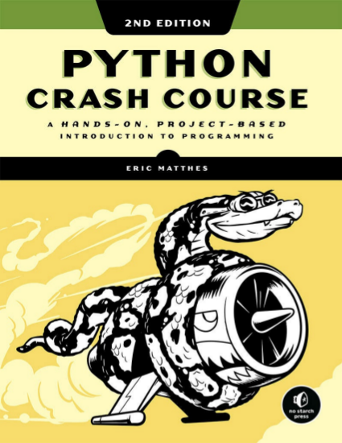

# Python Crash Course 2ª edição

## Indice

**PART I: BASICS**

1. Getting Started
1. Variables And Simple Data Types
1. Introduction Lists
1. Working With Lists
1. If Statements
1. Dictionaries
1. User Input And While Loops
1. Functions
1. Classes
1. Files And Exceptions
1. Testing Your Code

**PART II: PROJECTS**

